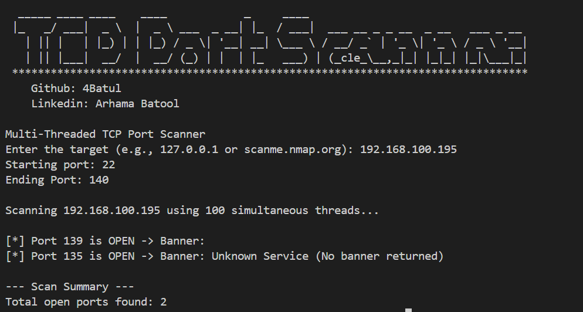

# TCP Port Scanner 

This project is a multi-threaded TCP port scanner written in Python. It allows you to scan a range of ports on a target host to identify open ports and retrieve service banners for those ports.

## Features
- Multi-threaded scanning for efficiency
- Detects open ports within a specified range
- Attempts to retrieve service banners from open ports
- User-friendly command-line interface

## How It Works
The script prompts the user to input the target host, starting port, and ending port. It then uses a thread pool to concurrently scan each port within the range. For each port:
- Attempts to establish a TCP connection
- If successful, sends a simple message and reads the banner
- Reports open ports along with their banners

## Demo


## Dependencies
- Python 3.x
- Standard Python libraries: `socket`, `sys`, `concurrent.futures`

## Usage
1. Save the script to a file, e.g., `tcp_port_scanner.py`.
2. Run the script using Python:

```bash
python main.py
